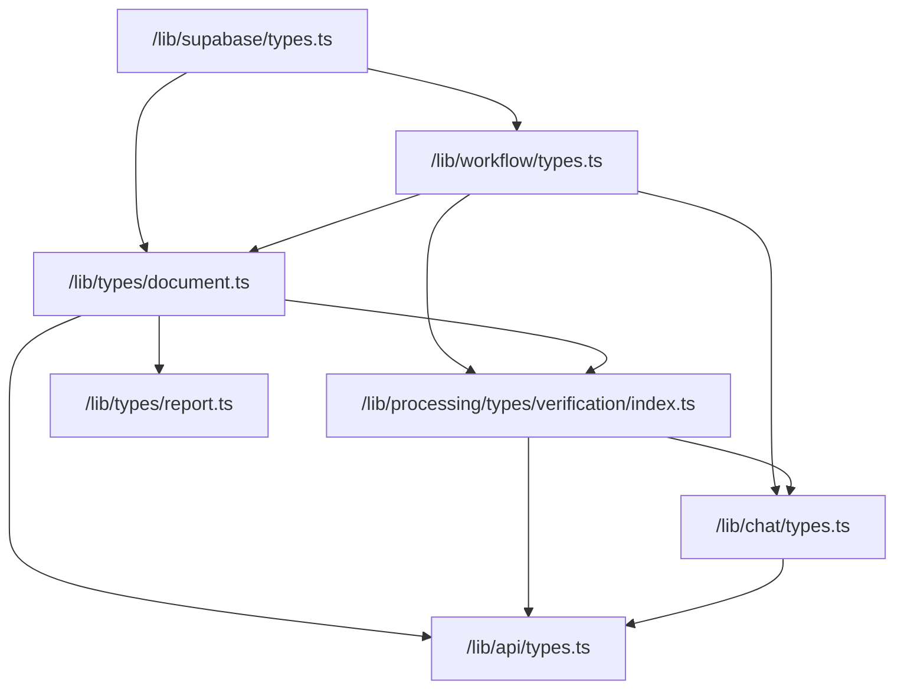
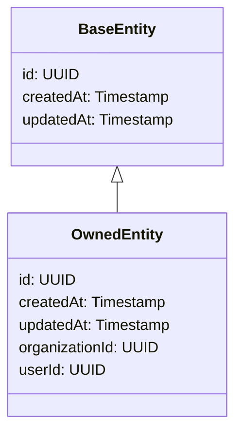
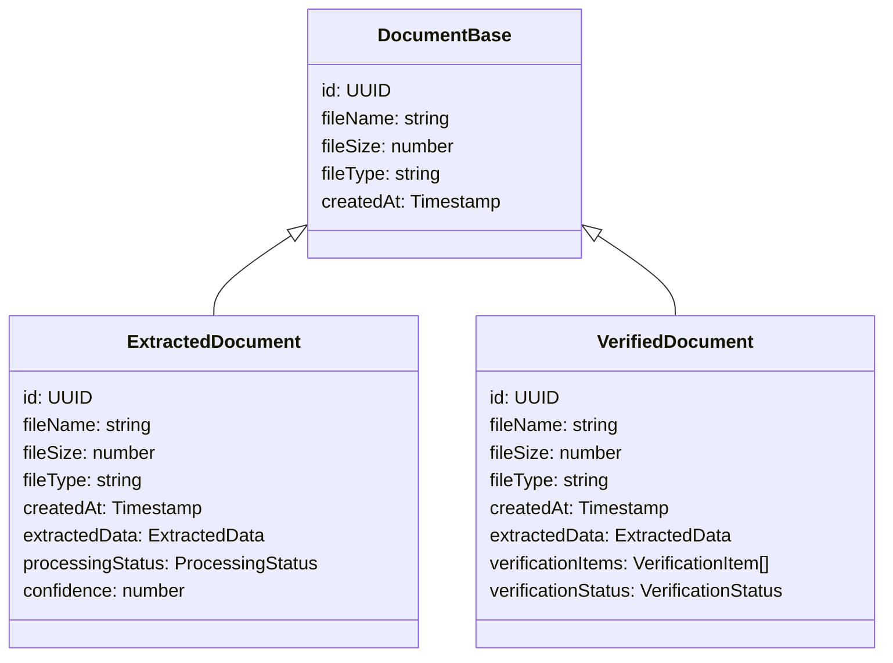
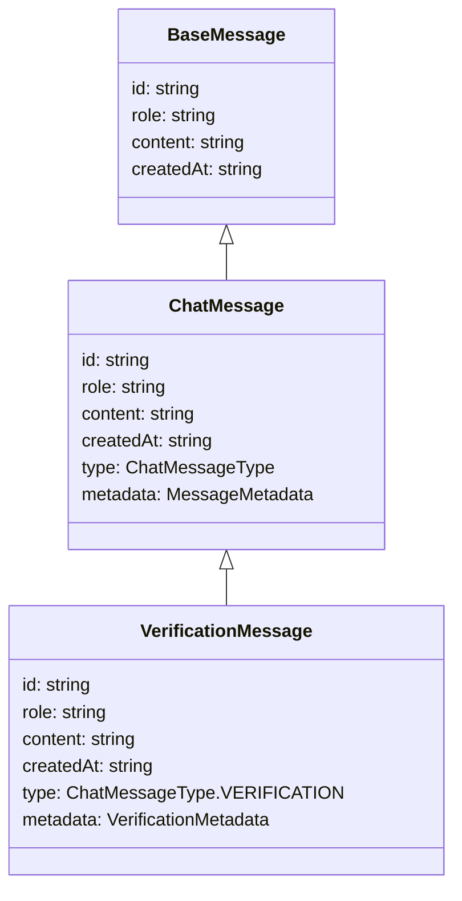

# TypeScript Type Dependencies

## Core Type Dependency Graph



## Key Type Inheritance Hierarchies

### Entity Hierarchy



### Document Hierarchy



### Message Hierarchy



## Duplicated Type Definitions

The following types are defined in multiple places and need consolidation:

1. **ProcessingStatus**
   ```mermaid
   graph TD
       doc["/lib/types/document.ts#L406-L431"] --- chat["/lib/chat/types.ts#L812-L842"]
   ```

2. **WorkflowStep**
   ```mermaid
   graph TD
       workflow["/lib/workflow/types.ts#L45-L65"] --- verification["/lib/processing/types/verification/index.ts#L588-L599"]
   ```

3. **Document Types**
   ```mermaid
   graph TD
       document["/lib/types/document.ts"] --- processing["/lib/processing/types/document.ts"]
       document --- schemas["/lib/schemas/document-types.ts"]
   ```

4. **Date Utilities**
   ```mermaid
   graph TD
       supabase["/lib/supabase/types.ts#L140-L151"] --- verification["/lib/processing/types/verification/index.ts#L492-L533"]
   ```

## Type Evolution Plan

Based on the dependency analysis, we recommend the following type evolution:

1. **Foundation Layer**
   - `/lib/types/base.ts` - Core utility types (UUID, Timestamp, etc.)
   - `/lib/types/db.ts` - Database-specific types

2. **Domain Layer**
   - `/lib/types/document.ts` - Document types
   - `/lib/types/workflow.ts` - Workflow types
   - `/lib/types/verification.ts` - Verification types
   - `/lib/types/chat.ts` - Chat and message types
   - `/lib/types/report.ts` - Report types

3. **API Layer**
   - `/lib/types/api.ts` - API request/response types
   - `/lib/schemas` - Zod schemas for validation

4. **Unified Exports**
   - `/lib/types/index.ts` - Barrel exports for all types