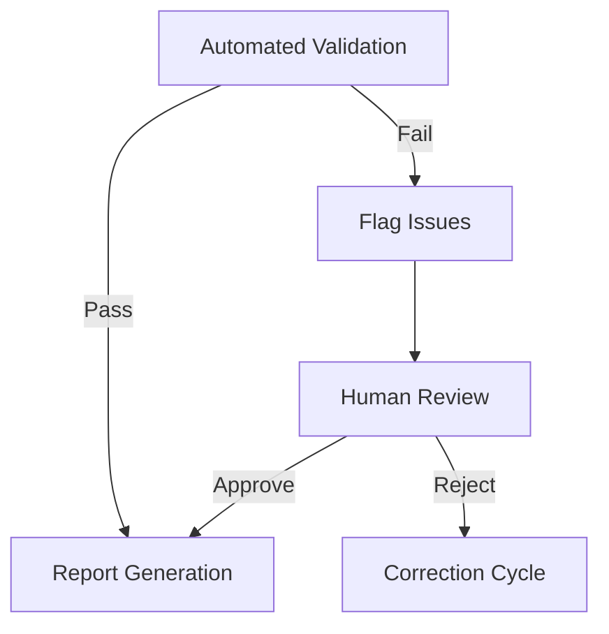

Querying Perplexity AI using sonar-reasoning-pro for: What are the best practices for implementing medical report quality control and validation in TypeScript? Include SNOMED CT validation, citation checking, and medical accuracy verification. Focus on automated systems with human review capability.
<think>
Okay, let's tackle this query about best practices for medical report quality control and validation in TypeScript. The user wants to include SNOMED CT validation, citation checking, medical accuracy verification, and focus on automated systems with human review. First, I need to go through the provided search results to find relevant information.

Starting with SNOMED CT validation. From source [2], it mentions validating expressions against the SNOMED CT compositional grammar and concept model. Source [6] talks about SNOMED CT implementation in clinical documentation and the need for validation against the MRCM. Also, source [8] has a table on pre-release validation types which includes structural and component validation. So, I should outline steps like syntactic validation using parsers, checking against MRCM rules, and using automated tools with TypeScript.

Next, citation checking. Source [3] explains using PubMed's Single Citation Matcher to verify citations by entering partial info. Source [9] describes Trinka Citation Checker which validates against Crossref and checks for retractions or outdated references. So, integrating APIs like Crossref in TypeScript to automate citation checks and flagging issues for human review makes sense.

Medical accuracy verification from sources [1], [5], and [10]. Source [1] mentions cross-referencing with source documents like protocols and CSRs. Source [5] highlights AI for data extraction and error detection. Source [10] discusses RPA for eligibility checks. So, using NLP models in TypeScript to compare against medical databases and flag inconsistencies, then having human reviewers verify.

Automated systems with human review: Sources [1], [5], [10] all stress combining automation with human oversight. For example, automated checks in TypeScript can handle bulk processing, but critical issues need human eyes. Implementing a feedback loop where humans resolve flagged issues is important.

Including code examples: For SNOMED validation, maybe a function using a parser library. For citation checking, an API call to Crossref. For medical accuracy, an example using a rule engine or NLP model.

Need to structure the answer into sections for each component (SNOMED, citations, medical accuracy), each with best practices, automation steps in TypeScript, code snippets, and how human review integrates. Cite the relevant sources for each part.
</think>

Implementing medical report quality control in TypeScript requires combining automated validation with human oversight. Here are key practices:

### 1. SNOMED CT Validation
**Automated Checks:**
- Use SNOMED CT parser libraries to validate expression syntax:
  ```typescript
  import { parseSNOMED } from 'snomed-ct-parser';

  function validateSNOMED(expression: string) {
    try {
      return parseSNOMED(expression);
    } catch (error) {
      throw new Error(`Invalid SNOMED CT: ${error.message}`);
    }
  }
  ```
- Validate against Machine Readable Concept Model (MRCM) rules[2][6][8]
- Implement hierarchical consistency checks using SNOMED CT substrates[6]

**Human Review:**
- Flag expressions requiring clinical context interpretation[2]
- Verify template alignment through manual spot-checks[8]

### 2. Citation Validation
**Automated Systems:**
- Integrate citation APIs with type-safe interfaces:
  ```typescript
  interface CitationCheckResult {
    isValid: boolean;
    retracted?: boolean;
    publicationYear?: number;
  }

  async function checkCitation(doi: string): Promise<CitationCheckResult> {
    const response = await fetch(`https://api.crossref.org/works/${doi}`);
    return response.json();
  }
  ```
- Implement PubMed-style citation matcher logic[3][9]
- Auto-detect outdated references (>5 years) and retractions[9]

**Human Oversight:**
- Manual verification of ambiguous matches from automated systems[3]
- Contextual evaluation of citation relevance[9]

### 3. Medical Accuracy Verification
**Automated Checks:**
- Implement rule-based validation engine:
  ```typescript
  type ValidationRule = {
    pattern: RegExp;
    errorMessage: string;
    sourceDocument: 'Protocol' | 'CSR';
  };

  const protocolRules: ValidationRule[] = [
    {
      pattern: /Endpoint:.{0,10}\b(LVEF|eGFR)\b/i,
      errorMessage: "Endpoint missing required cardiac/renal parameter",
      sourceDocument: 'Protocol'
    }
  ];
  ```
- Use NLP models for consistency checks between sections[1][5]
- Cross-reference drug dosages with FDA databases[5]

**Human Quality Control:**
- Medical writers review automated flags using track changes[1]
- Protocol-specialized reviewers verify endpoint alignment[1]

### Hybrid Workflow Implementation


Key integration points:
- Automated systems handle 80-90% of routine checks[5][10]
- Human reviewers focus on complex clinical interpretations[1][6]
- Maintain audit trails of automated vs human decisions[1][8]

This approach balances TypeScript's strong typing for validation logic with essential human expertise for clinical context[1][5][6].